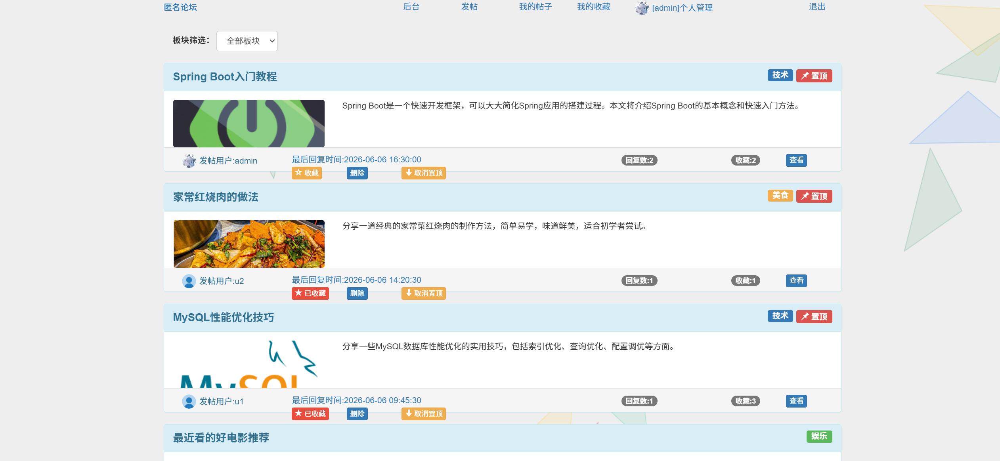
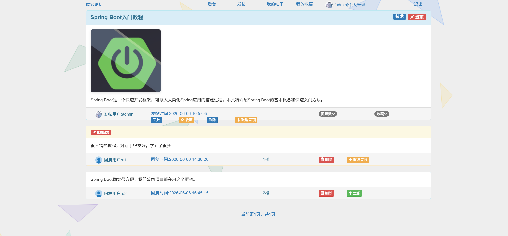

# 09老师说的都队

### 唐浩 赵文熙 陈闽 彭浩 樊世奇

<p align="center">
  
</p>

# BBS论坛系统

一个基于Spring Boot + MyBatis的轻量级论坛系统，支持用户注册登录、发帖回复、收藏管理、积分系统、关注粉丝、实时通知等完整的论坛功能。

## 预览

<p align="center">
  
</p>

<p align="center">
  
</p>


## 技术栈

### 后端技术

- **框架**: Spring Boot 2.7.18
- **持久层**: MyBatis 2.3.1
- **数据库**: MySQL 8.0.33
- **连接池**: Druid 1.2.20
- **模板引擎**: Thymeleaf
- **构建工具**: Maven
- **Java版本**: 1.8
- **云存储**: 阿里云OSS SDK 3.18.1
- **实时通信**: WebSocket (Spring Boot Starter)
- **HTTP客户端**: OkHttp 4.12.0
- **切面编程**: Spring AOP

### 前端技术

- **模板引擎**: Thymeleaf
- **样式框架**: Bootstrap 3.3.6
- **JavaScript**: jQuery 2.0.0
- **动态背景**: Canvas 粒子动画 / 三角形背景

## 核心功能

✅ 用户注册登录和个人信息管理
✅ 多板块发帖（娱乐、技术、美食、旅游、问题）
✅ 帖子回复和置顶回复功能（回复可置顶、可删除）
✅ 帖子收藏和收藏管理
✅ 积分系统和奖励机制（问答板块可设置悬赏积分）
✅ 关注/粉丝系统（关注用户、查看动态）
✅ 实时通知推送（WebSocket 实时通知回复、收藏、关注、系统广播）
✅ 通知中心（分类查看、已读/未读管理）
✅ 管理员后台（用户禁言/解禁/删除、帖子管理、全局广播通知）
✅ 帖子置顶和板块分类
✅ 封面图片上传（阿里云OSS）
✅ 用户账户注销功能
✅ Canvas 动态背景（粒子效果、三角形动画）
✅ 彩蛋功能（帖子 ID 12 内置音乐播放器、问答游戏、视频播放）

## 快速开始

### 环境要求

- Java 1.8 或更高版本
- MySQL 8.0 或更高版本
- Maven 3.6 或更高版本

### Windows系统启动

#### 方法1：一键启动（推荐）

1. 以管理员运行 `run.bat`
2. 脚本会自动完成数据库更新和项目启动

#### 方法2：手动启动

```bash
# 1. 启动MySQL服务
# 2. 创建数据库并导入数据
mysql -u root -p123456
CREATE DATABASE bbs CHARACTER SET utf8mb4;
USE bbs;
source bbs.sql;

# 3. 编译项目
mvn clean compile

# 4. 启动应用
mvn spring-boot:run
```

### Linux/macOS系统启动

#### 方法1：一键启动（推荐）

```bash
# Python 一键启动（跨平台）
python3 run.py
```

#### 方法2：手动启动

```bash
# 1. 安装必要依赖
sudo apt update
sudo apt install mysql-server maven openjdk-8-jdk

# 2. 启动MySQL服务
sudo systemctl start mysql

# 3. 创建数据库并导入数据
mysql -u root -p123456
CREATE DATABASE bbs CHARACTER SET utf8mb4;
USE bbs;
source bbs.sql;

# 4. 编译项目
mvn clean compile

# 5. 启动应用
mvn spring-boot:run
```

### 通用启动

java -jar bbs.jar

## 访问应用

应用启动后，访问以下地址：

- 主页面: http://localhost:8080

## 默认账户

### 管理员账户

- 用户名: `admin`
- 密码: `123456`

### 普通用户账户

- 用户名: `u1` / `u2` / `u3`
- 密码: `123456`

## 项目结构

```
├── src/main/java/com/zzx/
│   ├── Application.java              # 应用启动类
│   ├── controller/                   # 控制器层
│   │   ├── IndexController.java      # 首页、分页、分类筛选、搜索
│   │   ├── UserController.java       # 注册、登录、个人信息、注销
│   │   ├── PostController.java       # 发帖、编辑、删除、置顶
│   │   ├── ReplyController.java      # 回复、删除回复、置顶回复
│   │   ├── FavoriteController.java   # 收藏/取消收藏
│   │   ├── FollowController.java     # 关注/取消关注
│   │   ├── HostController.java       # 管理员后台
│   │   ├── NotificationController.java # 通知中心
│   │   └── QuickStartController.java # 快速入门指南
│   ├── service/                      # 服务层接口与实现
│   ├── mapper/                       # MyBatis数据访问接口
│   ├── model/                        # 实体类 (User, Post, Reply等)
│   ├── config/                       # 配置类
│   │   ├── WebSocketConfig.java      # WebSocket 注册
│   │   ├── OssConfig.java            # 阿里云OSS配置
│   │   └── GlobalModelAdvice.java    # 全局模型属性
│   ├── websocket/                    # WebSocket实时推送
│   │   └── NotificationWebSocketHandler.java
│   ├── exception/                    # 全局异常处理
│   └── utils/                        # 工具类
├── src/main/resources/
│   ├── application.yml              # 主配置文件
│   ├── application-dev.yml          # 开发环境配置
│   ├── mapper/                      # MyBatis XML映射文件
│   ├── templates/                   # Thymeleaf模板 (15+页面)
│   └── static/                      # 静态资源 (CSS/JS/图片)
├── bbs.sql                          # 数据库脚本 (含测试数据)
├── run.bat                          # Windows一键启动脚本
├── run.py                           # 跨平台Python自动启动脚本
└── pom.xml                          # Maven配置文件
```

## 数据库配置

默认数据库配置（application-dev.yml）：

- **数据库**: MySQL
- **地址**: localhost:3306
- **数据库名**: bbs
- **用户名**: root
- **密码**: 123456

## 阿里云OSS配置

系统使用阿里云OSS存储帖子封面图片，配置文件中的OSS参数：

- **endpoint**: 接入点
- **bucket-name**: 桶名
- **access-key-id**: 请替换为您的AccessKey ID
- **access-key-secret**: 请替换为您的AccessKey Secret

## 主要页面说明

### 首页

- 显示所有帖子列表，支持分页
- 按置顶状态和最后回复时间排序
- 显示帖子板块分类和收藏数量
- 顶部导航栏显示通知和用户信息
- 动态Canvas粒子/三角形背景

### 发帖/编辑帖子

- 选择板块（娱乐、技术、美食、旅游、问题）
- 输入标题和内容
- 可选上传封面图片（阿里云OSS）
- 问答板块可设置悬赏积分（1-10分）

### 帖子详情页

- 显示帖子完整内容和封面图片
- 显示所有回复，置顶回复优先显示
- 支持回复、删除回复、收藏帖子
- 楼主或管理员可置顶回复
- 彩蛋帖（ID 12）内含音乐播放器、问答游戏和视频

### 个人中心

- 显示用户信息和当前积分
- 修改个人资料（头像、手机、职业、地址）
- 查看我的帖子、我的收藏
- 关注管理（我的关注、我的粉丝）

### 通知中心

- 实时WebSocket推送通知
- 分类查看（回复通知、收藏通知、关注通知、系统通知）
- 已读/未读状态管理
- 一键删除通知

### 管理员后台

- 用户管理（禁言、解禁、注销账户）
- 帖子管理（删除、置顶、取消置顶）
- 全局系统广播通知
- 彩蛋开关（控制帖子12是否跳转视频页）

## 开发说明

### 代码规范

- 遵循Java编码规范
- 使用MyBatis注解和XML混合开发
- 异常处理采用全局异常处理器

### WebSocket 实时通知

- 终端连接地址: `/ws/notification`
- 通过 `NotificationWebSocketHandler` 管理 WebSocket 会话
- 支持按用户ID定向推送通知
- 通知类型: reply（回复）、favorite（收藏）、follow（关注）、system（系统）

### 数据库设计

共6张表，外键约束在数据库层面移除，由应用程序层维护数据完整性：

| 表名 | 说明 | 核心字段 |
|------|------|----------|
| `user` | 用户表 | uid, uname, upwd, ustate, level, score, path(头像) |
| `post` | 帖子表 | pid, ptitle, pbody, category, is_sticky, prize, uid |
| `reply` | 回复表 | rid, pid, uid, replymessage, is_sticky |
| `favorite` | 收藏表 | fid, uid, pid (uid+pid唯一) |
| `follow` | 关注表 | fid, uid, follow_uid (uid+follow_uid唯一) |
| `notification` | 通知表 | nid, uid, type, content, from_uid, pid, is_read |

## 常见问题

### Q: 应用启动失败怎么办？

A: 检查以下几点：

1. MySQL服务是否启动
2. 数据库连接配置是否正确
3. 端口8080是否被占用

### Q: 如何修改数据库密码？

A: 修改 `application-dev.yml` 中的数据库密码配置，并确保MySQL用户密码匹配。

### Q: 如何更换OSS配置？

A: 在 `application-dev.yml` 中修改阿里云OSS的相关配置参数。

## 许可证

本项目仅供学习和教学使用

## 作者

21078

## 版本

v1.0.0 (2026-05-19)
